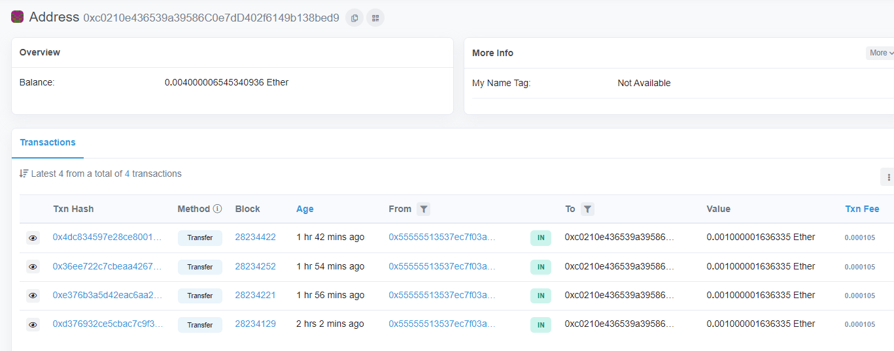
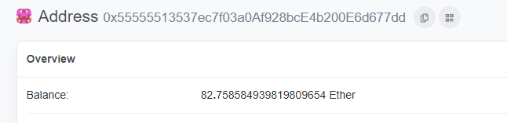
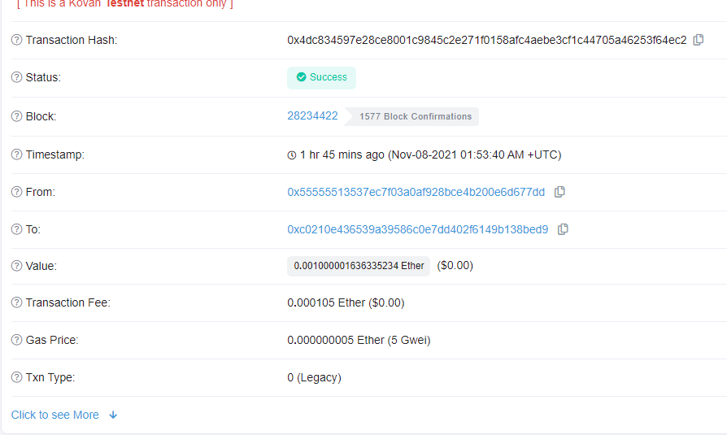

# module_19_challenge
# FinTech Finder
The goal for this site is to create a FinTech professional. The site highlights four professionals, their rate, and profile image. 
-------------------------------------------------------------------------------------------------------------------------

## Technologies Used
We used VS Code, web3, mnemonic, Streamlit, Kovan, and Infura.  
-------------------------------------------------------------------------------------------------------------------------

## Installation
We will need to install streamlit *can be pip install* and connect Infura with Kovan faucet. 
-------------------------------------------------------------------------------------------------------------------------

## Example
We use streamlit and it highlights all of the professionals. On the left it shows our send transaction, we pick the person who we want our professional and it tells the user what their rate is as well. We get to pick the amount of hours we want to have them work for.
-------------------------------------------------------------------------------------------------------------------------

## Images

My ether account balance

Recipient Balance

Example of Transaction Hash

